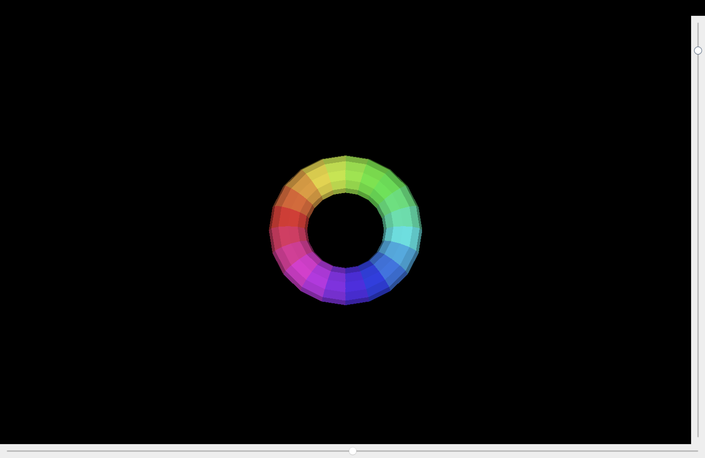

# Java 3D Torus Renderer (Software Rendering)

This project is a simple 3D **software renderer** written in Java using Swing and AWT.  
It renders a rotating **torus (donut)** with:

- Custom 3D math (`Matrix3`, `Vertex`)
- Triangle mesh generation
- Z-buffer (depth buffer)
- Basic lighting / shading
- Barycentric rasterization
- Interactive rotation using sliders

You can control the rotation with:
- A horizontal slider (heading / yaw)
- A vertical slider (pitch)

---

## Preview



---

## How It Works (Short)

- A torus mesh is generated using two angles:
  - `majorSegments` (around the big circle)
  - `minorSegments` (around the small circle)
- For each segment, a `Vertex(x, y, z)` is created.
- Each quad of the torus is split into **two triangles** (`Triangle`).
- The `GuiWindow` class:
  - Uses a `JPanel` and `BufferedImage` to draw every frame.
  - Applies rotation with `Matrix3`:
    - Heading (Y-axis rotation)
    - Pitch (X-axis rotation)
  - Transforms 3D vertices to 2D screen coords.
  - Uses **barycentric coordinates** to fill each triangle pixel-by-pixel.
  - Uses a **z-buffer** array to keep the closest pixel per screen position.
  - Applies a simple lighting intensity and shades the triangle color.

---

## Files (Expected)

Typical structure:

```text
.
├── GuiWindow.java   // Main GUI + rendering loop (sliders + torus rendering)
├── Triangle.java    // Triangle class (v1, v2, v3, color, lighting helpers)
├── Vertex.java      // Simple 3D vertex: x, y, z
├── Matrix3.java     // 3x3 matrix for rotation transforms
└── README.md
